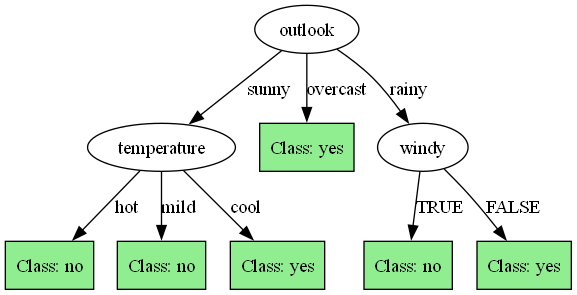

# Decision Tree Learning Implementation

An implementation of the ID3 (Iterative Dichotomiser 3) algorithm for decision tree learning, designed for learning and teaching.

## Algorithm Overview

### What is a Decision Tree?

A decision tree is a supervised machine learning algorithm used for both classification and regression tasks. The algorithm creates a tree-like model where:
- Each internal node represents a decision based on a feature
- Each branch represents an outcome of that decision
- Each leaf node represents a class label (classification) or value (regression)

### ID3 Algorithm

This implementation uses the ID3 (Iterative Dichotomiser 3) algorithm, which builds decision trees using a top-down, greedy approach. The core concepts are:

1. **Information Gain**: Measures how much information an attribute provides about the class. Mathematically, it represents the expected reduction in entropy caused by partitioning the examples according to the attribute. Higher information gain indicates a more useful attribute for classification.

2. **Entropy**: Measures the impurity or uncertainty in the data. In information theory, entropy quantifies the expected information content or "surprise" in the class distribution. A completely homogeneous set (all examples belong to the same class) has entropy of 0, while a perfectly divided set has maximum entropy.

   Entropy is calculated as: 
   ```
   Entropy(S) = -Σ p(i) * log₂(p(i))
   ```
   where p(i) is the proportion of examples that belong to class i.

3. **Recursive Partitioning**: The dataset is recursively split into smaller subsets based on the attribute with the highest information gain. This process creates a tree structure that represents a set of decision rules leading to the classification.

The ID3 algorithm is particularly effective for:
- Handling categorical attributes
- Creating human-interpretable models
- Situations where understanding the decision process is as important as the predictive accuracy

### How the Algorithm Works

1. **Calculate entropy** of the dataset with respect to the target class. This establishes the baseline impurity that we aim to reduce through splits.

2. **For each attribute**:
   - Calculate entropy after splitting the dataset on this attribute
   - For each possible value of the attribute, compute the proportion of examples with that value and their entropy
   - Calculate the weighted average of these entropies to get the expected entropy after the split
   - Calculate information gain (original entropy - weighted entropy after split)

3. **Select the attribute** with the highest information gain for the split. This attribute provides the most information about the class and creates the most homogeneous subsets.

4. **Create a decision node** for the selected attribute. This becomes an internal node in the tree with branches for each possible value of the attribute.

5. **Recursively repeat** the process for each subset created by the split, using only the attributes that have not been used in the path from the root.

6. **Stop** when one of the following termination criteria is met:
   - All instances in a subset belong to the same class (entropy = 0)
   - No attributes remain for further partitioning
   - A subset contains no examples (in which case we assign the majority class from the parent node)

The result is a tree structure where each path from the root to a leaf represents a classification rule.

## Project Structure

```
decision-tree-learning/
├── data/                 # Data directory
│   ├── raw/              # Raw ARFF datasets
│   ├── splits/           # Train/test split datasets
│   └── models/           # Saved models and visualizations
├── src/                  # Source code
│   ├── data/
│   │   └── data_loader.py # Data loading and preprocessing
│   ├── models/
│   │   ├── node.py        # Node class for the decision tree
│   │   └── decision_tree.py # Decision tree implementation
│   ├── utils/
│   │   └── visualization.py # Tree visualization utilities
│   └── main.py           # Main entry point
└── requirements.txt     # Project dependencies
```

## Implementation Details

### Key Components

#### 1. Node Class (`src/models/node.py`)
- Represents a node in the decision tree
- Can be either a decision node (with an attribute to split on) or a leaf node (with a class prediction)
- Maintains children nodes for each attribute value

#### 2. Decision Tree Class (`src/models/decision_tree.py`)
- Implements the ID3 algorithm
- Core methods:
  - `fit()`: Builds the tree from training data
  - `predict()`: Predicts the class for a given instance
  - `evaluate()`: Evaluates the model on test data
  - Information gain and entropy calculation methods

#### 3. Data Loader (`src/data/data_loader.py`)
- Loads and parses ARFF datasets
- Provides data splitting functionality
- Handles saving split datasets for reproducibility

#### 4. Visualization (`src/utils/visualization.py`)
- Text-based visualization of the decision tree
- Graphviz-based visual representation (if installed)

#### 5. Main Script (`src/main.py`)
- Command-line interface
- Orchestrates the workflow (data loading, model training, evaluation, visualization)

## Generated Files

The implementation generates several files during execution:

1. **Split Datasets** (in `data/splits/`)
   - `<dataset_name>_train.arff`: Training dataset
   - `<dataset_name>_test.arff`: Testing dataset

2. **Model Files** (in `data/models/`)
   - `<dataset_name>_model.pkl`: Pickled model file

3. **Visualizations** (in `data/models/`)
   - `<dataset_name>_tree.txt`: Text-based tree representation
   - `<dataset_name>_tree.png`: Graphical tree representation (if Graphviz is installed)

## Visualizations

The decision tree can be visualized in two ways:

1. **Text-based Visualization**:
   - A simple console-friendly representation using ASCII characters
   - Shows the tree structure with attribute names, branches for attribute values, and leaf nodes with class predictions

2. **Graphical Visualization** (requires Graphviz):
   - A graphical representation of the tree
   - Decision nodes show attribute names
   - Edges are labeled with attribute values
   - Leaf nodes show class predictions
   - Saved as PNG files

## Example Outputs

### Command Line Output

When running the decision tree algorithm on datasets, you'll see output similar to:

```
python src/main.py --mode all --visualize

Processing soybean_modify dataset...
Split datasets saved to data/splits/soybean_modify_*.arff
Model trained successfully
Model saved to data/models/soybean_modify_model.pkl

Decision Tree Results for soybean_modify:
Training set size: 393
Testing set size: 169
Accuracy on test set: 88.17%
Text tree visualization saved to data/models/soybean_modify_tree.txt
Graph visualization saved to data/models/soybean_modify_tree.png

Processing weather.nominal dataset...
Split datasets saved to data/splits/weather.nominal_*.arff
Model trained successfully
Model saved to data/models/weather.nominal_model.pkl

Decision Tree Results for weather.nominal:
Training set size: 9
Testing set size: 5
Accuracy on test set: 80.00%
Text tree visualization saved to data/models/weather.nominal_tree.txt
Graph visualization saved to data/models/weather.nominal_tree.png
```

### Text Visualization Example

The text-based visualization (`data/models/weather.nominal_tree.txt`) produces a human-readable representation of the decision tree:

```
Decision Tree Visualization
==================================================

└── outlook
    ├── sunny
    │   ├── temperature
    │       ├── hot
    │       │   └── Class: no
    │       ├── mild
    │       │   └── Class: no
    │       └── cool
    │           └── Class: yes
    ├── overcast
    │   └── Class: yes
    └── rainy
        └── windy
            ├── TRUE
            │   └── Class: no
            └── FALSE
                └── Class: yes
```

This shows that:
1. The root node splits on the "outlook" attribute
2. If outlook is "sunny", the decision is "no"
3. If outlook is "overcast", the decision is "yes"
4. If outlook is "rainy", the model checks the "windy" attribute:
   - If windy is "TRUE", the decision is "no"
   - If windy is "FALSE", the decision is "yes"

### Graphical Visualization

For more complex trees, a graphical visualization is generated in `data/models/weather.nominal_tree.png`:



This visualization uses Graphviz to create a more visually appealing representation, which is especially useful for larger trees with many attributes and values.

## Usage Instructions

### Prerequisites

- Python 3.6 or later
- Graphviz (optional, for graphical visualization)

### Installation

1. Clone the repository
2. Install dependencies:
```
pip install -r requirements.txt
```
3. Install Graphviz system package (optional, for visualization):
   - Windows: Download from https://graphviz.org/download/
   - Linux: `sudo apt-get install graphviz`
   - macOS: `brew install graphviz`

### Preparing Data

Place your ARFF (Attribute-Relation File Format) dataset files in the `data/raw/` directory.

### Running the Program

The main script offers several operation modes through command-line arguments:

```
python src/main.py [--mode MODE] [--dataset DATASET] [--visualize]
```

#### Arguments:

- `--mode`: Operation mode (default: "all")
  - `all`: Perform all operations (split data, train model, test model)
  - `split`: Only split the dataset into training and testing sets
  - `train`: Only train the model on the training set
  - `test`: Only test the model on the testing set (loads a pre-trained model if available)

- `--dataset`: Keyword to search in ARFF filenames
  - Example: `--dataset weather` will use the first ARFF file containing "weather" in its filename
  - If not specified, processes all ARFF files in the `data/raw/` directory

- `--visualize`: Generate visualizations of the decision tree

#### Examples:

1. Process all datasets with visualization:
```
python src/main.py --visualize
```

2. Train and test on a specific dataset:
```
python src/main.py --dataset weather --mode all --visualize
```

3. Only test a pre-trained model:
```
python src/main.py --dataset weather --mode test
```

4. Only split a dataset:
```
python src/main.py --dataset weather --mode split
```

## License

MIT License

Copyright (c) 2023

Permission is hereby granted, free of charge, to any person obtaining a copy
of this software and associated documentation files (the "Software"), to deal
in the Software without restriction, including without limitation the rights
to use, copy, modify, merge, publish, distribute, sublicense, and/or sell
copies of the Software, and to permit persons to whom the Software is
furnished to do so, subject to the following conditions:

The above copyright notice and this permission notice shall be included in all
copies or substantial portions of the Software.

THE SOFTWARE IS PROVIDED "AS IS", WITHOUT WARRANTY OF ANY KIND, EXPRESS OR
IMPLIED, INCLUDING BUT NOT LIMITED TO THE WARRANTIES OF MERCHANTABILITY,
FITNESS FOR A PARTICULAR PURPOSE AND NONINFRINGEMENT. IN NO EVENT SHALL THE
AUTHORS OR COPYRIGHT HOLDERS BE LIABLE FOR ANY CLAIM, DAMAGES OR OTHER
LIABILITY, WHETHER IN AN ACTION OF CONTRACT, TORT OR OTHERWISE, ARISING FROM,
OUT OF OR IN CONNECTION WITH THE SOFTWARE OR THE USE OR OTHER DEALINGS IN THE
SOFTWARE. 